# Testowanie i Jakość Oprogramowania

## Autor
**Szymon Adamczyk**<br>
nr. albumu: 36360

## Temat projektu
Sklep internetowy z artykułami barmańskimi i wbudowanym systemem treści edukacyjnych.

## Opis projektu
NiceBar to nowoczesna aplikacja webowa typu Headless Commerce umożliwiająca zakup sprzętu barmańskiego zintegrowanego z modułem bloga. Projekt symuluje realne środowisko sklepu internetowego, kładąc główny nacisk na proces zakupowy, bezpieczeństwo transakcji, logistykę zamówień oraz zarządzanie treścią.

System obsługuje dwie role użytkowników: Klienta oraz Administratora. Aplikacja realizuje pełną ścieżkę e-commerce: od przeglądania produktów, przez zarządzanie koszykiem i adresem dostawy, aż po bezpieczną płatność online i śledzenie statusu przesyłki.

**Główne funkcjonalności:**

### 1. Moduł sklepu i płatności
- **Katalog produktów:** Przeglądanie asortymentu z podziałem na ceny, kategorie i marki.
- **Koszyk zakupowy:** Dodawanie produktów, modyfikacja ilości oraz przeliczanie sumy zamówienia w czasie rzeczywistym.
- **Płatności online:** Pełna integracja z Stripe API. Obsługa bezpiecznych transakcji kartą oraz weryfikacja statusu płatności.

### 2. Panel użytkownika
- **Autentykacja i autoryzacja:** Bezpieczny system logowania i rejestracji oparty na sesjach serwerowych (Express-Session, MongoDB Store) oraz ciasteczkach `httpOnly`.
- **Zarządzanie profilem:** Edycja danych osobowych, bezpieczna zmiana hasła oraz zarządzanie domyślnym adresem dostawy.
- **Historia zamówień:** Podgląd złożonych zamówień wraz ze szczegółami produktów, kwotą oraz aktualnym statusem realizacji.

### 3. Panel administratora 
- **Zarządzanie produktami (CRUD):** Dodawanie nowych towarów, edycja cen, opisów i zdjęć oraz usuwanie produktów.
- **Zarządzanie zamówieniami:** Dostęp do listy wszystkich zamówień w systemie z możliwością podglądu danych do wysyłki.
- **Logistyka i statusy:** System zmiany statusów dostawy oparty na procesie, aktualizowany przez administratora, widoczny dla klienta.
- **Uprawnienia:** System umożliwiający w prosty, lecz bezpieczny sposób nadanie uprawnień administratora.

Aplikacja została skonteneryzowana przy użyciu platformy Docker, co zapewnia łatwość uruchomienia i spójność środowiska.

## Film z funkcjonowania aplikacji - blog
Film prezentuje uruchomienie środowiska Docker, wszystkie funkcjonalności aplikacji(moduł bloga), oraz obsługę autentykacji za pomocą **Express-Session i Connect-Mongo**  
**https://drive.google.com/file/d/1xTwAVIDrqsDtPar8HiEgixRw4RjM4r8o/view?usp=sharing**

## Film z funkcjonowania aplikacji - sklep
Film prezentuje wszystkie funkcjonalności modułu sprzedażowego, oraz obsługę płatności za pomocą **Stripe API**  
**https://drive.google.com/file/d/1htb5CCs3NcdDUMHNp0WUwT6Xm-fN0LEM/view?usp=drive_link**

## Uruchomienie projektu

> **Uwaga: Wymagane jest zainstalowane środowisko Docker oraz poprawnie skonfigurowany plik `.env`.**

**Projekt jest w pełni skonfigurowany do pracy z Dockerem. Aby uruchomić całe środowisko (Frontend, Backend, baza danych), należy wykonać poniższą komendę w głównym katalogu projektu:**

```bash
docker-compose up --build
```

Aplikacja będzie dostępna pod adresem: **http://localhost:5173**<br>
Serwer będzie działał pod adresem: **http://localhost:5000**

### Alternatywnie (uruchomienie lokalne bez Dockera):

**Backend:**
```bash
cd backend
npm install
npm run dev 
```

Frontend:
```bash 
cd frontend  
npm install 
npm run dev
```

# Dokumentacja API
System backendowy udostępnia interfejs REST API działający pod adresem domyślnym: Base URL: http://localhost:5000

### Uwierzytelnianie
API wykorzystuje mechanizm sesji serwerowych.
- Typ: apiKey (Cookie)
- Nazwa ciasteczka: connect.sid
- Opis: Po poprawnym zalogowaniu serwer ustawia ciasteczko sesyjne httpOnly, które musi być dołączane do każdego zapytania wymagającego autoryzacji.

## 1. Autentykacja i profil użytkownika
Zarządzanie kontem użytkownika oraz sesjami. 

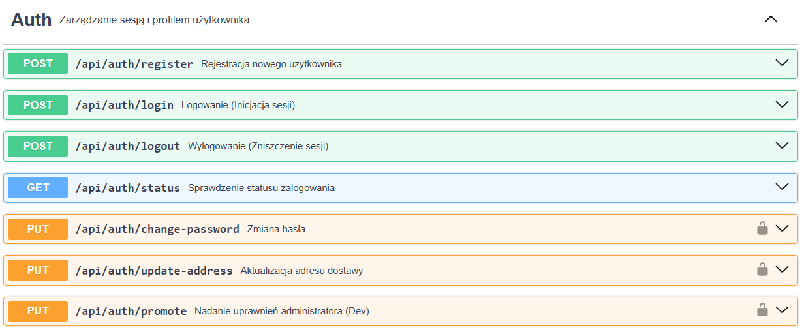

## 2. Produkty i kategorie produków
Zarządzanie asortymentem sklepu oraz kategoriami.

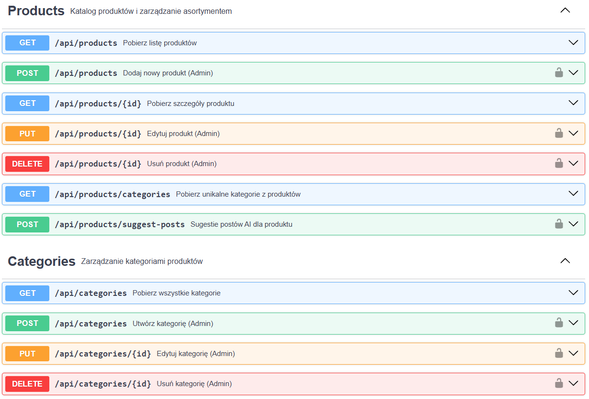

## 3. Blog 
System treści edukacyjnych i komentarzy.

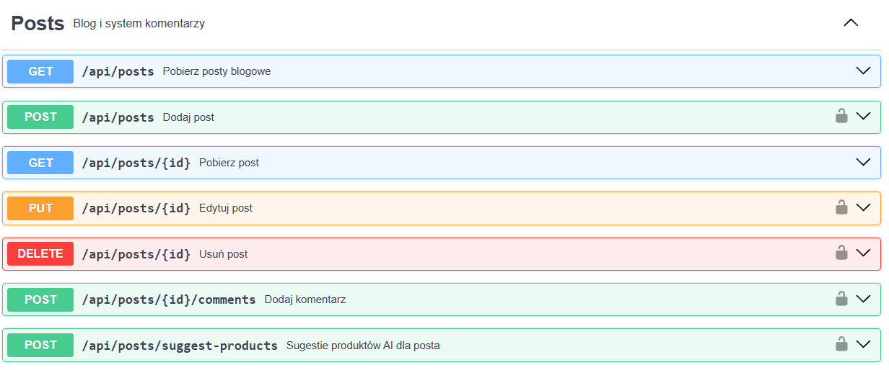

## 4. Zamówienia 
Obsługa procesu zakupowego, płatności Stripe oraz wyświetlanie zamówień.

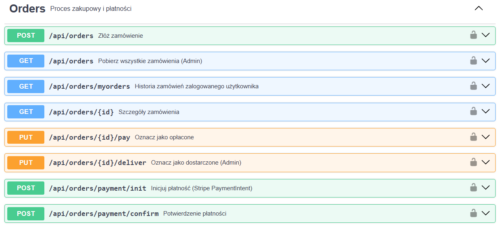

## 5. Administracja i pliki
Panel administracyjny użytkowników oraz obsługa multimediów.

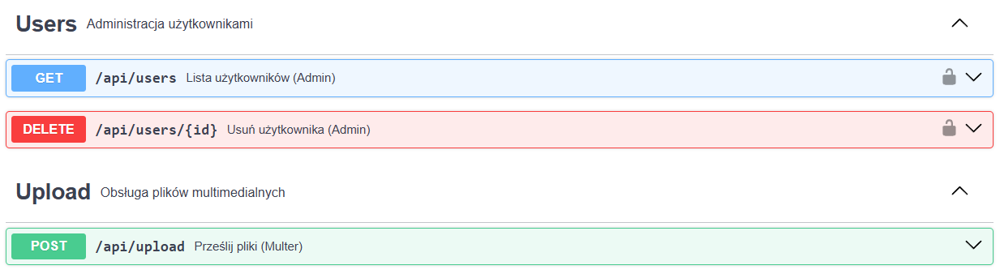


# Testy aplikacji

W projekcie zastosowano wielowarstwowe podejście do testowania, obejmujące testy jednostkowe komponentów (Frontend) oraz testy integracyjne API (Backend).  
Celem testów było zapewnienie stabilności kluczowych procesów biznesowych, takich jak zakupy, płatności oraz zarządzanie treścią.

---

## 1. Testy jednostkowe (Frontend)

Testy frontendowe zostały zrealizowane przy użyciu **Vitest** oraz **React Testing Library**.  
Skupiają się na renderowaniu komponentów, interakcjach użytkownika oraz logice routingu.

**Lokalizacja:**  
`frontend/src/Tests/`

### Pokrycie testowe

#### Autoryzacja – `Auth.test.jsx`
- Poprawność wywołania funkcji logowania z przekazanymi danymi
- Walidacja formularza rejestracji 

#### Sklep – `Shop.test.jsx`
- Renderowanie szczegółów produktu 
- Obsługa przycisku **„Dodaj do koszyka”** i wywołanie funkcji kontekstu
- Obsługa pustego koszyka oraz statusów dostawy 
- Logika niedostępności towaru – blokada przycisku przy `countInStock = 0`
- Wyświetlanie powiązanych wpisów blogowych dla produktu

#### Blog – `Blog.test.jsx`
- Wyświetlanie tytułu i treści pojedynczego wpisu
- Ukrywanie sekcji produktów, gdy wpis nie posiada powiązań z żadnym z nich
- Interakcja sekcji komentarzy (dodawanie komentarza przez zalogowanego użytkownika)
- Funkcjonalność **„Szybki zakup”** z poziomu wpisu blogowego

#### Routing – `Routing.test.jsx`
- Obsługa błędnych adresów URL
- Przekierowanie z nieistniejącej ścieżki na stronę główną (obsługa 404)

### Wynik testów modułu zakupowego - `Shop.test.jsx`
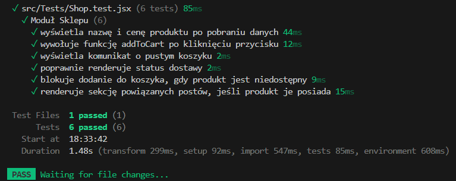

**Uruchomienie testów frontendu:**
```bash
docker exec -it nicebar-frontend-1 npm test
```

### 2. Testy integracyjne (Backend)
Testy backendowe zrealizowane za pomocą **Jest** oraz **Supertest**. Weryfikują one poprawność działania endpointów API, komunikację z bazą danych MongoDB oraz mechanizmy bezpieczeństwa.

* **Lokalizacja:** `backend/tests/integration.test.js`

### Pokrycie testowe

#### Autentykacja 
- Rejestracja nowego użytkownika 
- Logowanie administratora oraz użytkownika (weryfikacja nagłówka Set-Cookie)
- Odrzucenie logowania przy błędnym haśle

#### Produkty (CRUD)
- Pobieranie listy produktów i kategorii
- Tworzenie produktu 
- Blokada tworzenia produktu dla niezalogowanych użytkowników 
- Aktualizacja danych produktu 
- Usuwanie produktu:
    - Administrator – operacja dozwolona
    - Użytkownik – błąd 403 Forbidden

#### Walidacja danych
- Blokada utworzenia produktu z ujemną ceną

### Wynik testów integracyjnych Backendu
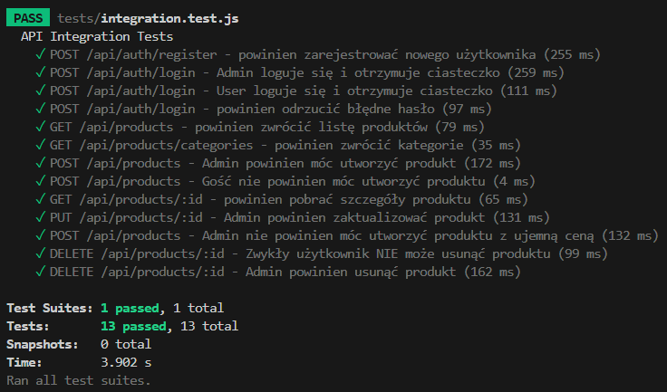

**Uruchomienie testów backendu:**
```bash
docker exec -it nicebar-backend-1 npm test
```
### 3. Przypadki testowe – testy manualne (Test Case)
Poniżej przedstawiono scenariusze testowe weryfikujące zarówno główne ścieżki użytkownika, jak i przypadki brzegowe.

---

### TC001 – Rejestracja użytkownika z niezgodnymi hasłami

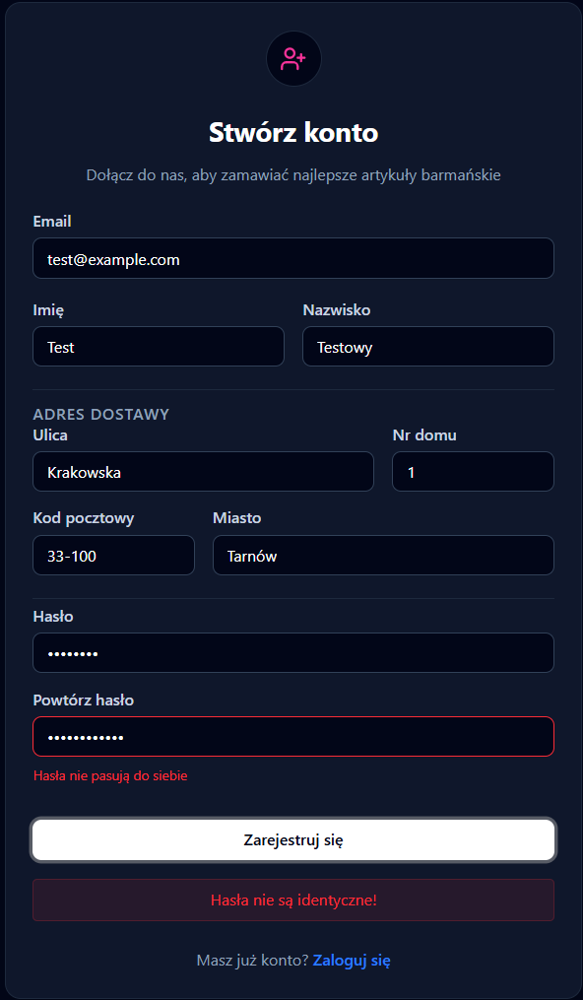

| Pole | Opis |
|------|------|
| **ID** | TC001 |
| **Tytuł** | Rejestracja użytkownika z niezgodnymi hasłami |
| **Warunki początkowe** | Użytkownik znajduje się na stronie `/register` |
| **Kroki testowe** | 1. Wpisz poprawny adres email (np. `test@example.com`)<br>2. W polu „Hasło” wpisz `Haslo123`<br>3. W polu „Powtórz hasło” wpisz `InneHaslo456`<br>4. Kliknij „Zarejestruj” |
| **Oczekiwany rezultat** | Formularz nie zostaje wysłany. Wyświetla się komunikat: „Hasła nie pasują do siebie”. |

---

### TC002 – Blokada zakupu produktu wyprzedanego 

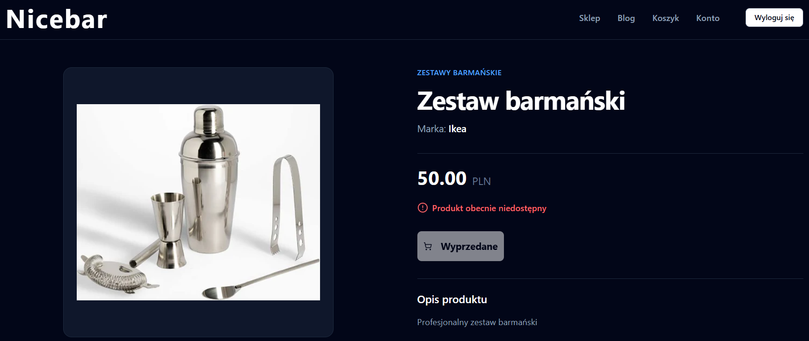

| Pole | Opis |
|------|------|
| **ID** | TC002 |
| **Tytuł** | Blokada zakupu produktu wyprzedanego |
| **Warunki początkowe** | Produkt posiada stan magazynowy `0` |
| **Kroki testowe** | 1. Otwórz stronę szczegółów produktu<br>2. Zlokalizuj przycisk „Dodaj do koszyka”<br>3. Spróbuj kliknąć przycisk |
| **Oczekiwany rezultat** | Przycisk jest nieaktywny, posiada etykietę „Wyprzedane”. Produkt nie trafia do koszyka. |

---

### TC003 – Dodanie komentarza do wpisu blogowego

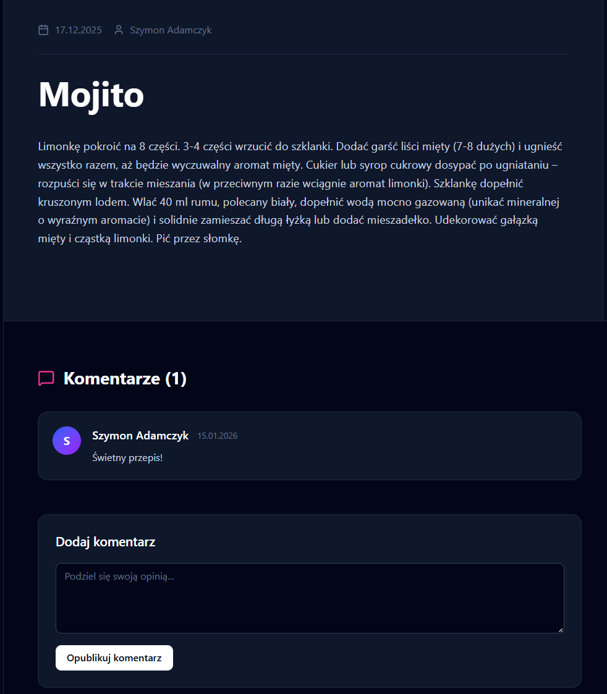

| Pole | Opis |
|------|------|
| **ID** | TC003 |
| **Tytuł** | Dodanie komentarza do wpisu na blogu |
| **Warunki początkowe** | Użytkownik jest zalogowany i znajduje się na stronie wpisu |
| **Kroki testowe** | 1. Przewiń stronę do sekcji „Komentarze”<br>2. Wpisz treść: „Świetny przepis!”<br>3. Kliknij „Opublikuj komentarz” |
| **Oczekiwany rezultat** | Sekcja komentarzy zostaje odświeżona, a nowy komentarz pojawia się na liście z nazwą użytkownika. |

---

### TC004 – Test podsumowania koszyka

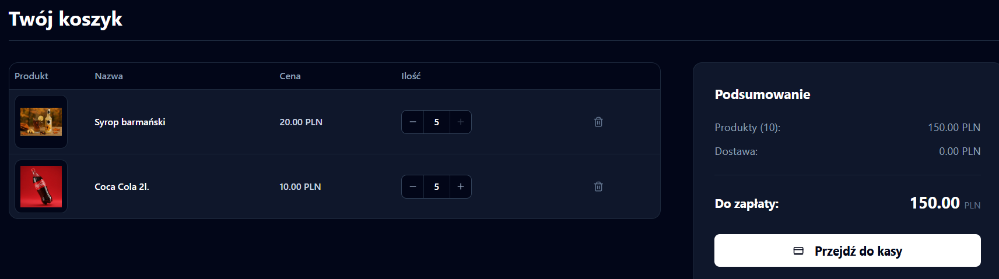
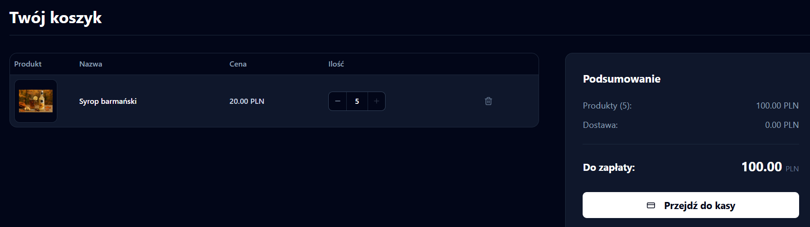

| Pole | Opis |
|------|------|
| **ID** | TC004 |
| **Tytuł** | Test podsumowania koszyka |
| **Warunki początkowe** | Użytkownik posiada co najmniej jeden produkt w koszyku (/cart). |
| **Kroki testowe** | 1. Wejdź w zakładkę koszyka.<br>2. Zlokalizuj produkt na liście.<br>3. Kliknij ikonę kosza (Usuń) przy produkcie. |
| **Oczekiwany rezultat** | Produkt znika z listy. Suma całkowita zostaje przeliczona i pomniejszona o cenę usuniętego towaru. |

---

### TC005 – Weryfikacja uprawnień aktualizacji produktu 

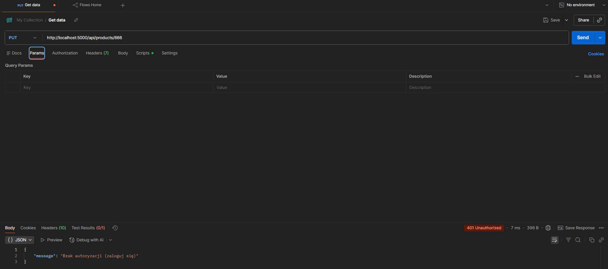

| Pole | Opis |
|------|------|
| **ID** | TC005 |
| **Tytuł** | Blokada aktualizacji produktu przez osobę bez uprawnień |
| **Warunki początkowe** | Użytkownik niezalogowany |
| **Kroki testowe** | 1. Wyślij żądanie PUT na endpoint `/api/products/{id}`<br>2. Sprawdź kod odpowiedzi HTTP |
| **Oczekiwany rezultat** | Serwer zwraca kod 401 Unauthorized. Produkt nie zostaje zaktualizowany w bazie danych. |

---

### TC006 – Szybki zakup produktu powiązanego z wpisem blogowym

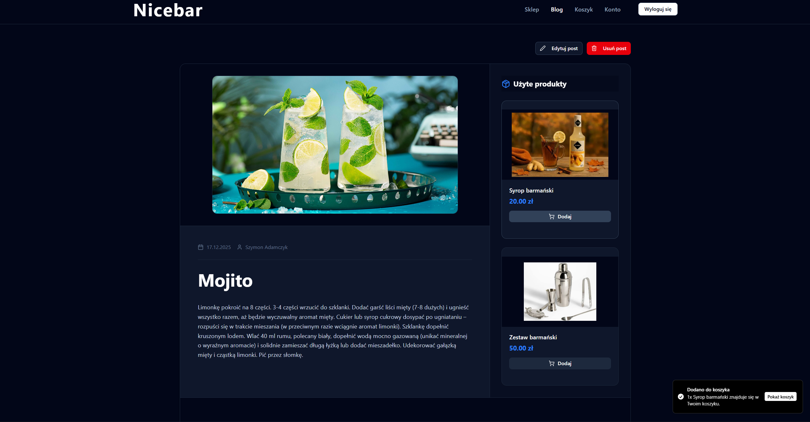

| Pole | Opis |
|------|------|
| **ID** | TC006 |
| **Tytuł** | Szybki zakup produktu z wpisu blogowego |
| **Warunki początkowe** | Wpis blogowy zawiera listę powiązanych produktów |
| **Kroki testowe** | 1. Przejdź do sekcji „Produkty z tego wpisu”<br>2. Kliknij „Dodaj do koszyka” przy wybranym produkcie<br>3. Sprawdź licznik koszyka |
| **Oczekiwany rezultat** | Licznik koszyka zwiększa się o 1. Wyświetla się komunikat Toast o dodaniu produktu. |

---

### TC007 – Zmiana domyślnego adresu dostawy

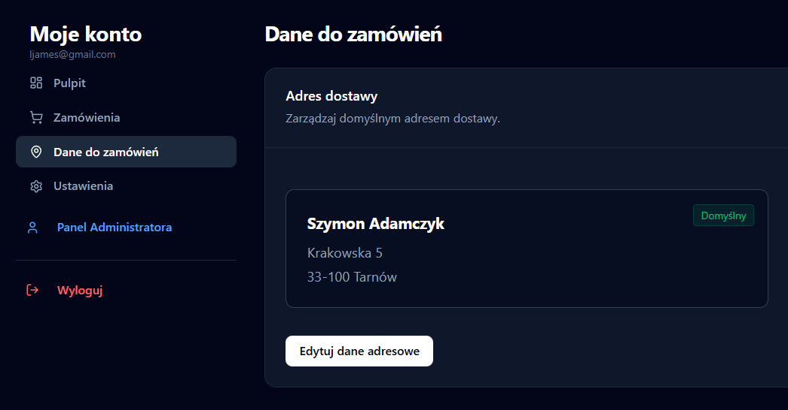
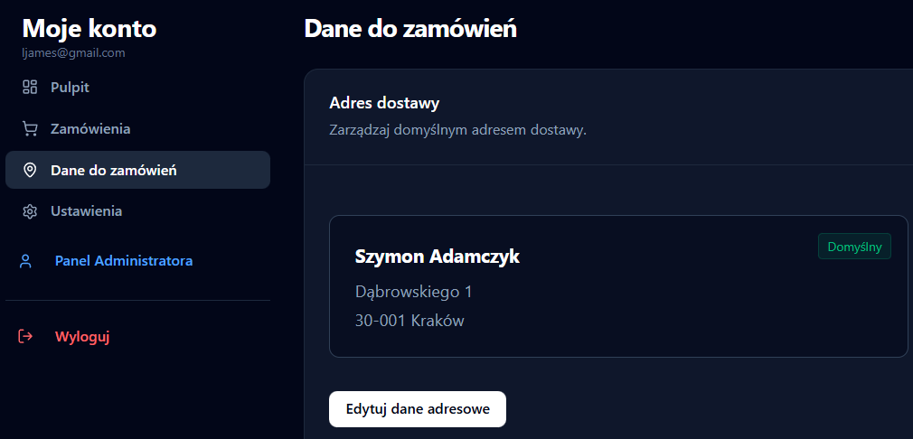

| Pole | Opis |
|------|------|
| **ID** | TC007 |
| **Tytuł** | Użytkownik jest zalogowany i znajduje się w panelu użytkownika |
| **Warunki początkowe** | Użytkownik jest zal |
| **Kroki testowe** | 1. W formularzu adresu zmień wyświetlane dane na inną wartość .<br>2. Kliknij przycisk "Aktualizuj" |
| **Oczekiwany rezultat** | Pojawia się komunikat o sukcesie. Po automatycznym odświeżeniu widoku w polu widnieje nowa wartość. |

---

### TC008 – Edycja ceny produktu przez Administratora

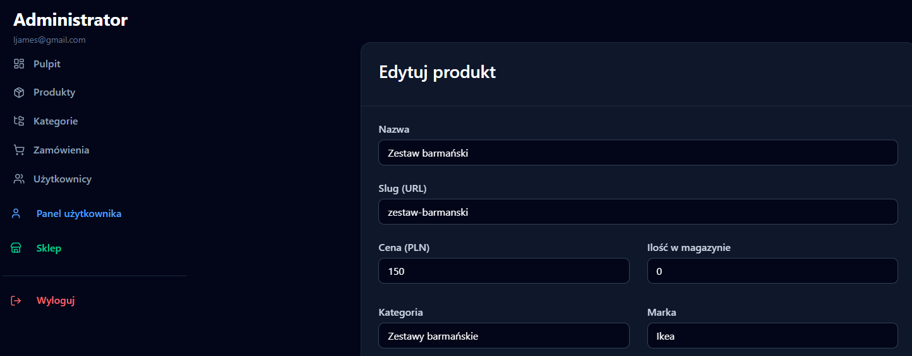

| Pole | Opis |
|------|------|
| **ID** | TC008 |
| **Tytuł** | Edycja ceny produktu |
| **Warunki początkowe** | Zalogowany Administrator, dostęp do Panelu Administratora |
| **Kroki testowe** | 1. Wybierz produkt i kliknij „Edytuj”<br>2. Zmień cenę<br>3. Zapisz zmiany<br>4. Otwórz stronę sklepu |
| **Oczekiwany rezultat** | Produkt wyświetla nową, zaktualizowaną cenę. |

---

### TC009 – Weryfikacja powiązań: Produkt → wpis blogowy

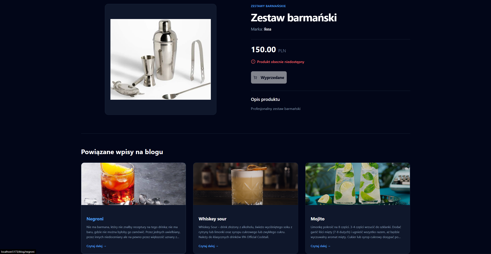

| Pole | Opis |
|------|------|
| **ID** | TC009 |
| **Tytuł** | Wyświetlanie powiązanych wpisów blogowych |
| **Warunki początkowe** | Produkt posiada przypisane wpisy blogowe |
| **Kroki testowe** | 1. Otwórz stronę szczegółów produktu<br>2. Przejdź do sekcji „Powiązane wpisy na blogu”<br>3. Kliknij tytuł wpisu |
| **Oczekiwany rezultat** | Następuje poprawne przekierowanie do treści artykułu blogowego. |

---

### TC010 – Weryfikacja wyświetlania statusu dostawy

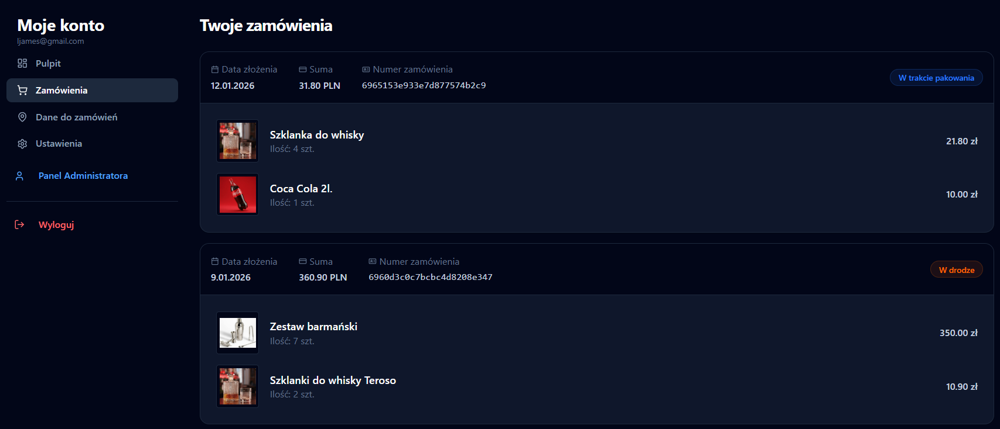

| Pole | Opis |
|------|------|
| **ID** | TC010 |
| **Tytuł** | Wyświetlanie statusu dostawy zamówienia |
| **Warunki początkowe** | Zamówienie posiada status „Wysłane” |
| **Kroki testowe** | 1. Zaloguj się jako klient<br>2. Przejdź do zakładki „Moje zamówienia”<br>3. Sprawdź status zamówienia |
| **Oczekiwany rezultat** | Status zamówienia wyświetla się poprawnie (np. badge „Wysłane” lub „W drodze”). |

---

## Technologie użyte w projekcie
**Backend:**
- **Node.js** - środowisko uruchomieniowe.
- **Express.js** - framework serwerowy.
- **MongoDB & Mongoose** - baza danych NoSQL oraz ODM do modelowania danych.
- **Express-Session & Connect-Mongo** - obsługa sesji użytkowników i ich zapis w bazie.
- **Bcrypt** - bezpieczne hashowanie haseł.
- **Stripe API** - obsługa płatności online.
- **Gemini API** - generowanie sugestii treści przez AI dla powiązań produktów i postów.
- **Multer** - obsługa przesyłania plików (zdjęcia produktów).

**Frontend:**
- **React.js** - biblioteka do budowy interfejsu użytkownika.
- **Vite** - narzędzie do budowania i uruchamiania projektu.
- **React Router** - routing po stronie klienta.
- **Axios** - klient HTTP do komunikacji z API.
- **Stripe.js & React Stripe** - bezpieczne komponenty płatności.
- **Tailwind CSS** - framework CSS do stylizacji.
- **Shadcn/ui & Lucide React** - biblioteka komponentów interfejsu i ikon.

**Testowanie:**
- **Vitest** - runner testów dla aplikacji Vite (Frontend).
- **React Testing Library** - testowanie komponentów React.
- **Jest** - framework testowy (Backend).
- **Supertest** - testowanie endpointów HTTP.

**Narzędzia programistyczne:**
- **Docker & Docker Compose** - konteneryzacja i orkiestracja serwisów.
- **Git** - system kontroli wersji.
